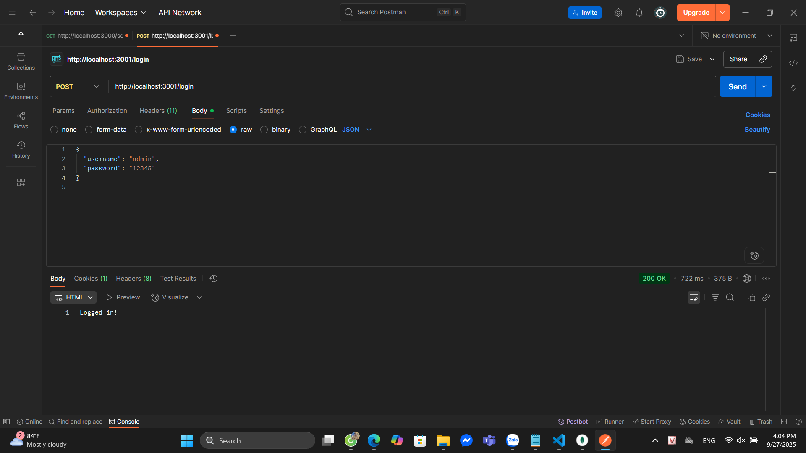
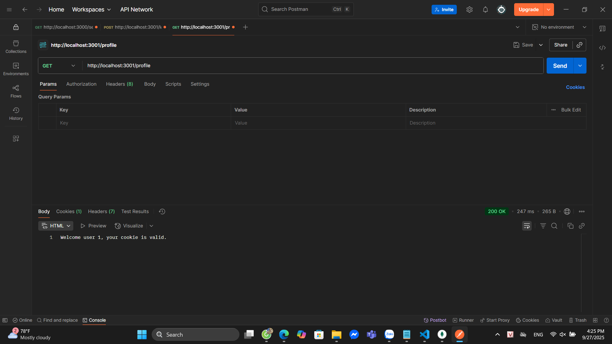
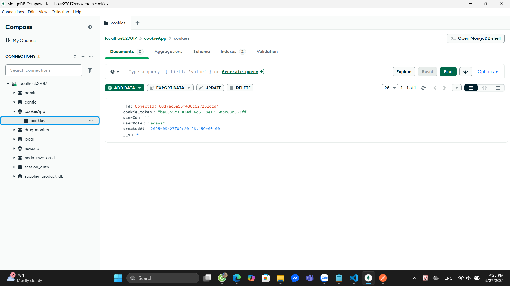

# simple_auth (LAB: Security in NodeJS)

## How to run
1. Install deps:
```bash
npm install
2. Start MongoDB (local or docker).

3. Start servers:
node basic_auth.js    # port 3000
node cookie_auth.js   # port 3001

Endpoints & How to test (POSTMAN)
- Basic Auth

GET http://localhost:3000/secure

Authorization: Basic admin:12345 → header Authorization: Basic YWRtaW46MTIzNDU=
Expected: You have accessed a protected resource 🎉


- Cookie Auth

POST http://localhost:3001/login

Body JSON: { "username": "admin", "password": "12345" }
Expected: Logged in! and Set-Cookie header.


GET http://localhost:3001/profile (cookie must be present)
Expected: Welcome user ...


POST http://localhost:3001/logout → cookie deleted.


Cookie in DB: 


(Ảnh nằm trong public/results/ đã commit)

---

# 7) Commit & push lên GitHub
Các lệnh mẫu:
```bash
git init
git add .
git commit -m "Simple auth lab: basic & cookie auth, screenshots"
git remote add origin https://github.com/ngoc-gif/simple_auth
git branch -M main
git push -u origin main
